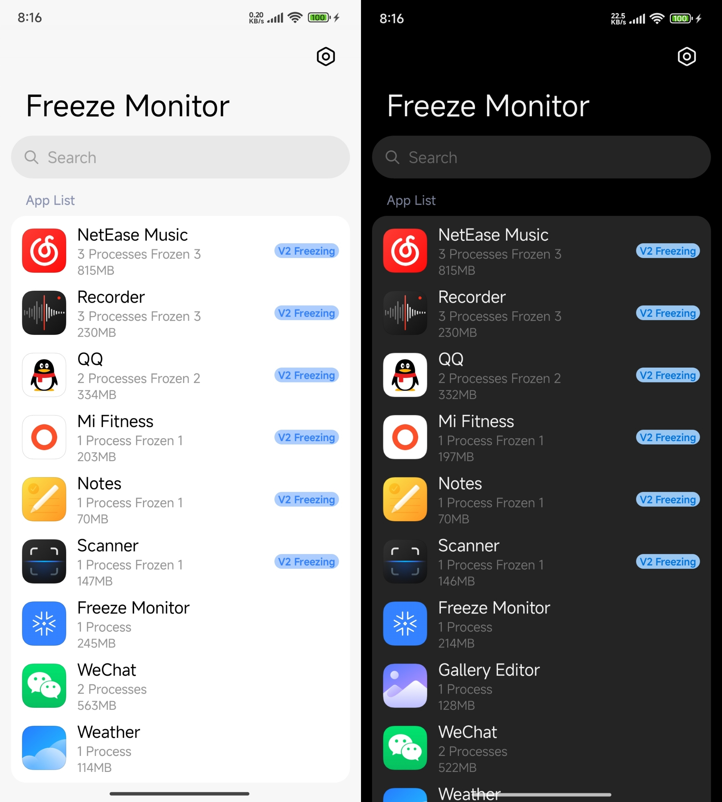

## Freeze Monitor

Freeze Monitor is a sample Android application process freeze monitor, built with
[Jetpack Compose](https://developer.android.com/jetpack/compose).

## Screenshot:

### Credits:

- [Accompanist](https://github.com/google/accompanist) library licensed under Apache License 2.0
- [Haze](https://github.com/chrisbanes/haze) library licensed under Apache License 2.0
- [Miuix](https://github.com/miuix-kotlin-multiplatform/miuix) library licensed under Apache License 2.0